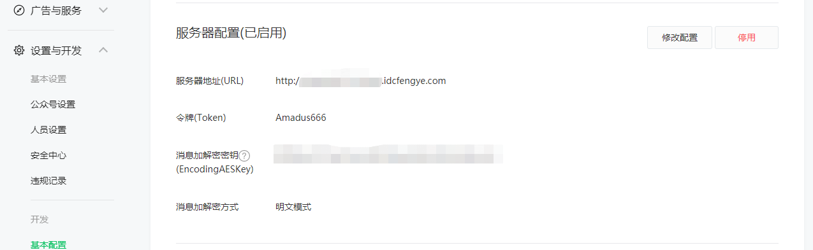
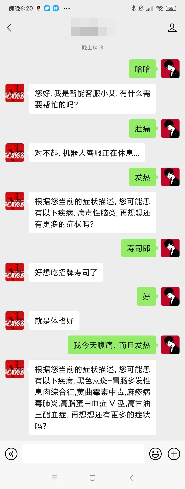

## AI_doctor

* 在线AI医生项目

## 部署环境

* 操作系统

  * Centos 8.3

* 项目使用的主要框架

  * pytorch 1.8.1
  
  * flask 2.0.1
  
  * neo4j
  
  * Redis
  
  * Gunicorn服务组件
  
  * werobot微信公众号服务组件
  
* 把data文件夹拷贝到主文件夹当中。
  
    

## 1、开启Redis数据库

开启Redis数据库，用于缓存从微信公众号接收而来的信息。

```shell
[root@localhost Michiru]# redis-server
```

## 2、开启Neo4j图数据库

```shell
[root@localhost Michiru]# neo4j start
```

## 3、开启主服务

开启主服务，用于接收微信公众号的信息。

进入到main_server文件夹, 开启服务。

``` shell
(pytorch) [Michiru@localhost data]$ cd data/doctor_online/main_server
(pytorch) [Michiru@localhost data]$ gunicorn -w 1 -b 0.0.0.0:5000 app:app
```

## 4、开启判断前后句子是否关联的服务

开启判断前后句子是否关联的服务，使用huggingface的bert-base-chinese模型来完成

进入到bert_serve文件夹，开启服务。

``` shell
(pytorch) [Michiru@localhost data]$ cd data/doctor_online/bert_serve
(pytorch) [Michiru@localhost data]$ gunicorn -w 1 -b 0.0.0.0:5001 app:app
```

## 5、联调测试

进入到main_server文件夹, 运行test.py文件。

``` shell
(pytorch) [Michiru@localhost data]$ cd data/doctor_online/main_server
(pytorch) [Michiru@localhost data]$ python test.py
```

## 6、项目部署

进入微信公众号https://mp.weixin.qq.com，进行应用的绑定。



服务器地址(URL)可以改为自己的服务器。如果本地部署则填写Ngrok内网穿刺映射的域名即可，映射入口在wr.py文件中进行修改。

## 7、最终效果



